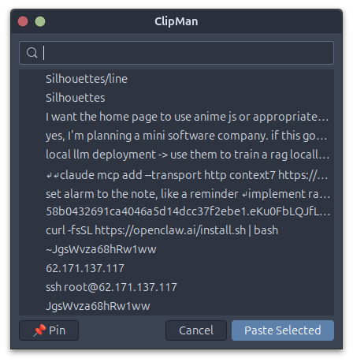

# ClipMan - Clipboard Manager for Linux

A simple, efficient clipboard manager for Linux (X11) with a GTK3 GUI.



## Features

- **Automatic Monitoring** - Runs in the background, capturing all clipboard changes
- **Persistent History** - Stores up to 100 clipboard entries (configurable)
- **Pin Items** - Pin important items to keep them forever
- **Quick Access** - Press `Alt+V` to open the picker dialog
- **Search** - Filter your clipboard history instantly
- **Double-click Paste** - Select an item and it pastes automatically
- **Auto-start** - Starts automatically when you log in

## Installation

### Debian Package (Recommended)

Download and install the latest `.deb` package:

```bash
# Install package
sudo dpkg -i clipman_1.0.0_all.deb

# Install dependencies if needed
sudo apt-get install -f

# The service will start automatically on next login
# To start immediately:
systemctl --user start clipman.service
```

### From Source

```bash
# Clone repository
git clone https://github.com/bawa/clipman.git
cd clipman

# Install dependencies
sudo apt-get install python3-gi python3-gi-cairo gir1.2-gtk-3.0 xclip xdotool

# Install system-wide
sudo make install
```

### Building .deb Package

```bash
# Install build dependencies
sudo apt-get install debhelper

# Build package
dpkg-buildpackage -us -uc -b

# Install resulting .deb
sudo dpkg -i ../clipman_1.0.0-1_all.deb
```

### Manual Install

```bash
# Clone repository
git clone https://github.com/bawa/clipman.git
cd clipman

# Create symlinks
ln -s $PWD/clipman ~/.local/bin/clipman
ln -s $PWD/clipman-gui ~/.local/bin/clipman-gui

# Enable auto-start (optional)
cp debian/clipman.service ~/.config/systemd/user/
systemctl --user enable clipman.service
systemctl --user start clipman.service
```

### Requirements

- Linux with X11
- Python 3.8+
- GTK3
- xclip
- xdotool

Install dependencies on Ubuntu/Debian:
```bash
sudo apt-get install python3-gi python3-gi-cairo gir1.2-gtk-3.0 xclip xdotool
```

## Usage

### Keyboard Shortcut

Press **Alt+V** to open the clipboard picker dialog.

### GUI Usage

| Action | Description |
|--------|-------------|
| Double-click | Select item and paste |
| Enter | Select item and paste |
| Escape | Close dialog |
| Right-click | Open context menu (Pin/Delete) |
| Type | Search/filter history |
| 📌 Pin button | Pin/unpin selected item |

### CLI Commands

```bash
# Start/Stop daemon
clipman start    # Start in background
clipman stop     # Stop daemon
clipman status   # Check status

# View history
clipman history              # Show last 20 entries
clipman history -n 50        # Show last 50 entries

# Copy items
clipman select 0     # Copy item at index 0 to clipboard

# Pin items
clipman pin 0        # Toggle pin status for item 0

# Clear history
clipman clear        # Clear all (keeps pinned items)

# Get current clipboard
clipman get          # Print current clipboard content
```

### Pinning Items

Pinned items:
- Appear at the top of the list with a 📌 icon
- Are never removed when history limit is reached
- Persist across restarts
- Survive `clipman clear` commands

**GUI:** Select item → Click "📌 Pin" or right-click → "Pin / Unpin"

**CLI:** `clipman pin <index>`

## Configuration

Edit `/usr/bin/clipman` (or `clipman` in the source directory) to customize:

```python
MAX_HISTORY = 100        # Maximum number of entries
POLL_INTERVAL = 0.5      # Clipboard check interval (seconds)
```

## Files

| Location | Purpose |
|----------|---------|
| `/usr/bin/clipman` | Main CLI command |
| `/usr/bin/clipman-gui` | GUI picker |
| `~/.config/clipman/history.json` | Clipboard history storage |
| `~/.config/clipman/clipman.pid` | Daemon PID file |
| `~/.config/systemd/user/clipman.service` | Systemd service (user) |

## Keyboard Shortcuts

| Shortcut | Action |
|----------|--------|
| `Alt+V` | Open clipboard picker |

To change the shortcut, edit the GNOME settings:
```bash
gsettings set org.gnome.settings-daemon.plugins.media-keys.custom-keybinding:/org/gnome/settings-daemon/plugins/media-keys/custom-keybindings/clipman/ binding "<Alt>V"
```

## Troubleshooting

### Daemon not running

```bash
clipman status
systemctl --user status clipman.service
```

### Restart daemon

```bash
systemctl --user restart clipman.service
```

### Disable auto-start

```bash
systemctl --user disable clipman.service
systemctl --user stop clipman.service
```

## License

[MIT](LICENSE)

## Author

[Bawa](https://github.com/bawa/clipman)

## Contributing

Contributions are welcome! Feel free to open issues or submit pull requests.
